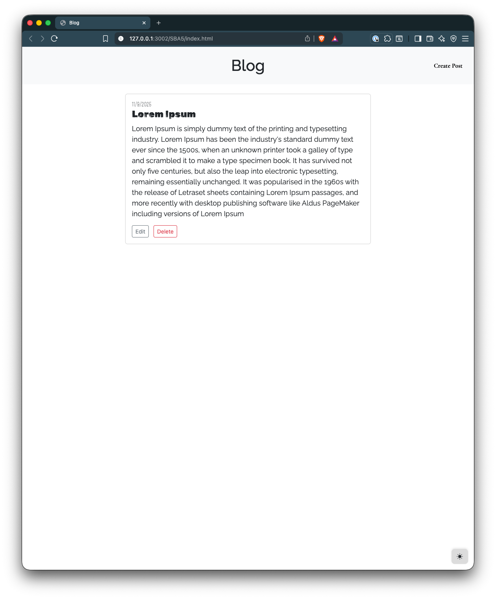
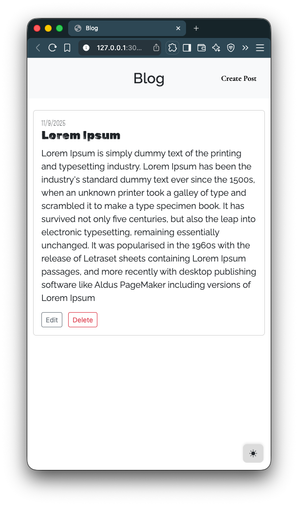

# 📝 Blog App

A simple client-side blog application built with **HTML, CSS, JavaScript, and Bootstrap 5**, featuring a **dark/light theme toggle** and **localStorage persistence** for posts. Users can create, edit, and delete posts directly in the browser without a backend.

---

## 🌟 Features

* **Create, Edit, Delete Posts** – All posts are saved in `localStorage`.
* **Dynamic Blog Cards** – Posts are rendered dynamically as Bootstrap cards.
* **Dark/Light Theme Toggle** – Switch between dark and light themes with a responsive icon.
* **Modal Form** – Create or edit posts using a Bootstrap modal.
* **Persistent Storage** – Posts remain available even after page reloads.

---

## 📂 Project Structure

```
/blog
│
├── index.html          # Main HTML file
├── style.css           # Custom styles
├── index.js            # JavaScript logic
├── screenshots         
│   ├── desktop.png     # Desktop screenshot
│   └── mobile.png      # Mobile screenshot 
└── README.md           # Project documentation
```

---

## ⚡ How to Use

1. Open `index.html` in your browser.
2. Click **Create Post** to open the modal.
3. Enter a **Title** and **Content**, then click **Save Post**.
4. Your post appears as a card in the main area.
5. Edit or delete posts directly using the buttons on each card.
6. Toggle between **Dark/Light** theme using the sun/moon icon.

---

## 🚀 Live Demo

> 🌐 **Live Demo:** [Click Here for Live Demo](https://structbase.github.io/Blog/)

> 💻 **Repository:** [View Source on GitHub](https://github.com/structbase/Blog)

---
## 📸 Screenshots

### 🖥️ Desktop Layout


### 📱 Mobile Layout


---

## 🛠 Technologies Used

* **HTML5 & CSS3**
* **JavaScript (ES6+)**
* **Bootstrap 5**
* **Bootstrap Icons**
* **LocalStorage API**

---

## 💡 Notes

* This project is purely client-side; there is **no backend**.
* Data persists via **localStorage**, so clearing browser data will remove all posts.
* The theme preference is saved in **localStorage** to persist user choice.

---
## 🏁 Credits & Resources
-   [MDN Web Docs – Event Propagation](https://developer.mozilla.org/en-US/docs/Learn_web_development/Core/Scripting/Events#event_propagation)
-   [MDN Web Docs – Window: localStorage](https://developer.mozilla.org/en-US/docs/Web/API/Window/localStorage)
-   [Bootstrap – Modal](https://getbootstrap.com/docs/5.3/components/modal/)
-   [Google](https://www.google.com/)
-   [Google-Fonts](https://fonts.google.com/)
---
## ✍️ Author

Developed by **Abenezer**

>  Junior developer 
